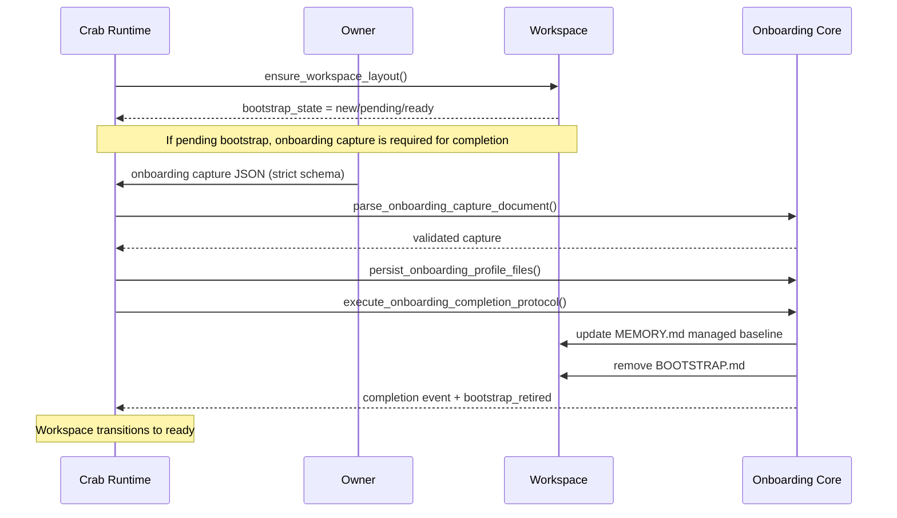

# Initial Turn And Onboarding

## Scope

This document defines first-run behavior, onboarding capture, and how Crab transitions a workspace from bootstrap to normal operation.

## Decisions

- Decision: bootstrap is stateful and explicit.
  - Rationale: onboarding must be deterministic and restart-safe.
  - Mechanism: `BOOTSTRAP.md` presence controls whether onboarding is still pending.

- Decision: onboarding capture is strict JSON, not free text.
  - Rationale: machine-parseable owner/agent identity data is required for reliable persistence and recovery.
  - Mechanism: schema-validated `OnboardingCaptureDocument` (`schema_version`, identity fields, goals, location, timezone).

- Decision: runtime completion trigger is explicit and owner-only while bootstrap is pending.
  - Rationale: avoid accidental onboarding completion from arbitrary natural-language turns.
  - Mechanism: owner submits strict onboarding JSON payload; runtime validates/commits it in normal turn flow.

- Decision: onboarding writes managed blocks and preserves legacy notes.
  - Rationale: avoid losing existing human-authored context while allowing deterministic rewrites.
  - Mechanism: managed markers in `SOUL.md`, `IDENTITY.md`, `USER.md` plus preserved-notes blocks.

## Bootstrap State Model

`WorkspaceBootstrapState`:

- `new_workspace`: workspace just created.
- `pending_bootstrap`: workspace exists and `BOOTSTRAP.md` exists.
- `ready`: workspace exists and `BOOTSTRAP.md` is retired.

State comes from workspace ensure/detection logic in `crates/crab-core/src/workspace.rs` and startup integration in `crates/crab-app/src/startup.rs`.

On every startup, workspace ensure also enforces skills layout policy:

- canonical skills root `.agents/skills`
- compatibility symlink `.claude/skills -> ../.agents/skills`
- built-in policy skill `.agents/skills/skill-authoring-policy/SKILL.md`

## Required Onboarding Questions

Onboarding question contract (`crates/crab-core/src/onboarding.rs`):

1. Who the agent is (name/role)
2. Who the owner is and working relationship
3. Primary goals (ordered list)
4. Physical machine location
5. Machine timezone

Capture schema (`v1`):

```json
{
  "schema_version": "v1",
  "agent_identity": "...",
  "owner_identity": "...",
  "primary_goals": ["..."],
  "machine_location": "...",
  "machine_timezone": "..."
}
```

Validation rules:

- no unknown keys
- all scalar fields non-empty
- `primary_goals` has at least one non-empty item
- `schema_version` must equal `v1`

## Sequence



Current implementation note:

- Prompt-orchestrated hidden onboarding question flow is not yet runtime-wired.
- Runtime completion path is fully wired for explicit owner JSON capture while bootstrap is pending.

## File Mutation Semantics

On completion:

- `SOUL.md`, `IDENTITY.md`, `USER.md` are rewritten with managed markers.
- legacy/manual notes are preserved in notes marker block.
- malformed marker conflicts are surfaced via `conflict_paths` for manual review.
- `MEMORY.md` receives a managed onboarding baseline section.
- `BOOTSTRAP.md` is removed.

## Onboarding Lifecycle State Machine

`OnboardingLifecycle` states:

- `pending`
- `in_progress` (must carry `onboarding_session_id`)
- `completed`
- `skipped`

Transitions (`crates/crab-core/src/onboarding_state.rs`):

- `Start { onboarding_session_id }`: `pending -> in_progress`
- `ResumeAfterRestart`: `in_progress -> in_progress`
- `Complete`: `in_progress -> completed`
- `Skip`: `pending|in_progress -> skipped`
- `Reset`: any valid state -> `pending`

Owner-only operator commands for manual control are available through `/onboarding rerun confirm` and `/onboarding reset-bootstrap confirm`.

## Invariants

- `in_progress` lifecycle must always carry a non-empty onboarding session id.
- completion event sequence must be > 0.
- workspace root must exist and be a directory before completion writes run.
- bootstrap retirement is idempotent (missing bootstrap file is treated as already retired).
