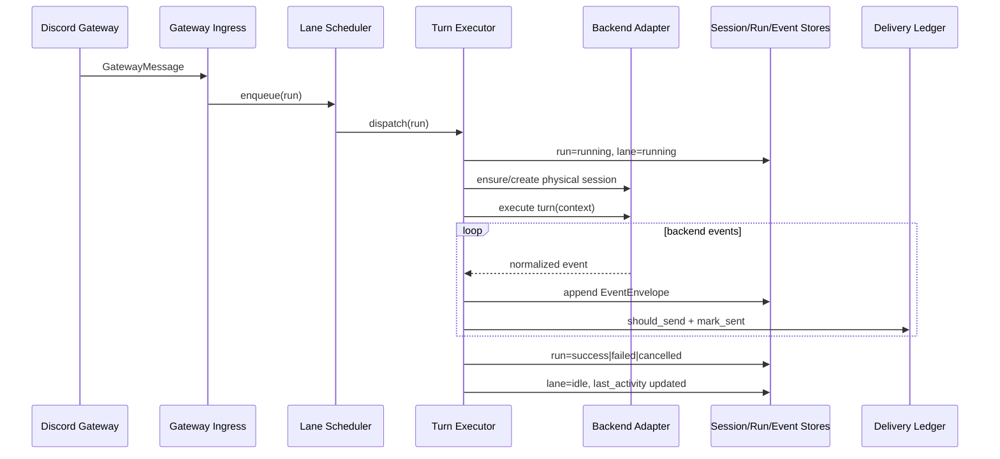

# Sessions, Lanes, And Turn Lifecycle

## Scope

This document defines:

- logical session identity
- physical backend session identity
- per-session lane queue semantics
- run lifecycle from Discord ingress to completion

## Decisions

- Decision: one logical session per Discord conversation surface.
  - Rationale: deterministic ordering and stable persistence keys.

- Decision: one lane per logical session.
  - Rationale: strict FIFO ordering per conversation while allowing cross-session parallelism.

- Decision: physical backend sessions are reusable and separate from logical sessions.
  - Rationale: preserve backend context continuity until explicit rotation/reset.

## Logical Session Mapping

`RoutingKey -> logical_session_id` (`crates/crab-discord/src/lib.rs`):

- Guild channel: `discord:channel:<channel_id>`
- Thread: `discord:thread:<thread_id>`
- DM: `discord:dm:<user_id>`

This ID is the durable partition key used by scheduler and stores.

Important: DM delivery target differs from the DM logical session id.

- DM `logical_session_id` uses the author's user id for durable lane partitioning.
- Discord replies must target the DM *channel id* (from the gateway message `channel_id`).
- Crab persists the DM channel id onto each `Run` as `delivery_channel_id` and uses it for
  outbound post/edit. It must not derive DM delivery targets from `discord:dm:<user_id>`.

## Physical Session Model

A logical session may have an active `PhysicalSession` with backend-specific ids:

- Claude: resumable Claude session id
- Codex: `threadId` on a persistent app-server
- OpenCode: server-side session id

`LogicalSession.active_physical_session_id` points to the currently bound physical handle.

## Lane Semantics

`LaneScheduler` (`crates/crab-scheduler/src/lib.rs`) invariants:

- strict FIFO within a lane
- max one active run per lane
- global active-lane cap (`max_concurrent_lanes`)
- queue overflow returns explicit invariant error (`lane_queue_overflow`)
- queued-run cancellation preserves order of remaining items

Lane state tokens in domain model:

- `idle`
- `running`
- `cancelling`
- `rotating`

## Turn Execution Sequence

Current orchestration path in `crates/crab-app/src/turn_executor.rs`:

1. Ingest Discord message (`GatewayIngress`)
2. Resolve `logical_session_id`
3. Build deterministic run id (`run:<logical_session_id>:<message_id>`)
4. Enqueue run in lane scheduler
5. Persist queued run + session metadata
6. Dispatch when lane is eligible
7. Resolve run profile (backend/model/reasoning)
8. Ensure physical session
9. Build turn context:
   - bootstrap context only when the physical session is new (`last_turn_id` absent)
   - raw user input when reusing an existing physical session
10. Execute backend turn
11. Normalize + persist events
12. Stream accumulated assistant output via delivery ledger
13. Persist final run/session state and completion event

## Attachment Handling

When a Discord message includes file or image attachments, the pipeline threads them through to
the backend agent:

1. **Connector** extracts attachment metadata (URL, filename, size, content_type) from Serenity
   `Message.attachments` and populates `GatewayMessage.attachments`.
2. **Daemon** (`persist_enqueued_run` in `turn_executor.rs`): downloads each attachment from the
   CDN URL to `state/attachments/{run_id}/`, then prepends file-path annotations to `user_input`:
   `[attached file: photo.png (saved to /path/to/state/attachments/run-id/photo.png)]`
3. **Claude Code** receives the annotated text and can read files (including images) via its
   built-in Read tool.
4. **Cleanup**: attachment directory is removed at run finalization (all terminal statuses:
   succeeded, failed, cancelled).
5. Attachments are ephemeral and do not survive session rotation.

Filename sanitization replaces path-traversal characters (`/`, `\`, `\0`) to prevent writes
outside the attachment directory.

## Run/Event Identity

- run id: deterministic from logical session + ingress message id
- turn id: deterministic from run id (`turn:<run_id>`)
- event id: deterministic for turn executor events (`evt:turn-executor:...`)
- event sequence: monotonic per run
- idempotency key persisted on envelopes

## Discord Runtime Adapter Boundary

`crates/crab-discord/src/runtime_adapter.rs` provides the runtime transport seam used by production wiring:

- inbound: `DiscordRuntimeEvent::MessageCreate` -> `GatewayIngress` -> `IngressMessage`
- outbound: `post_message` / `edit_message` with deterministic retry policy for retryable and
  rate-limited transport errors
- hard failures propagate as runtime errors (no silent drop)

This keeps Discord SDK specifics in a transport implementation while preserving Crab's
store/scheduler/turn-executor semantics.

## Sequence

## Current Status

- Lane scheduling and dispatch pipeline are implemented and tested.
- Idempotent output replay is implemented.
- Rotation-trigger evaluation is implemented in turn finalization.
- Startup reconciliation + heartbeat maintenance entry points are implemented in `crab-app`.
- Production runtime binary loop wiring is implemented (`crabd` + `crab-discord-connector`).
- Remaining deployment blocker is target-machine acceptance checklist execution evidence (`WS18-T5`),
  tracked in `crab/docs/08-deployment-readiness-gaps.md`.
