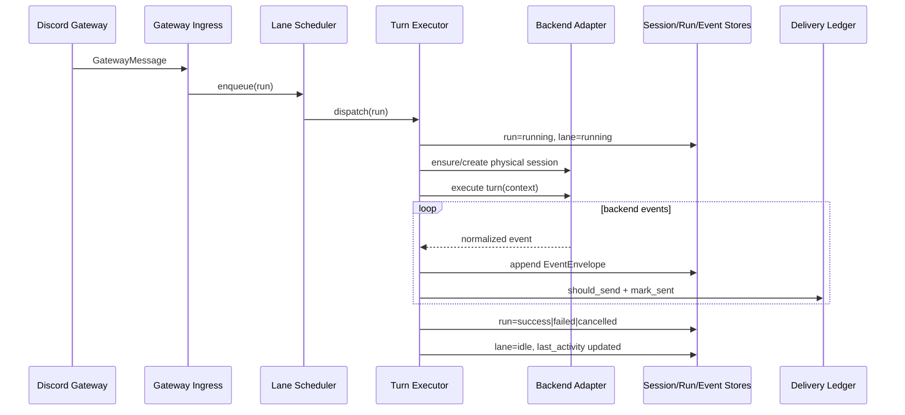

# Sessions, Lanes, And Turn Lifecycle

## Scope

This document defines:

- logical session identity
- physical backend session identity
- per-session lane queue semantics
- run lifecycle from Discord ingress to completion

## Decisions

- Decision: one logical session per Discord conversation surface.
  - Rationale: deterministic ordering and stable persistence keys.

- Decision: one lane per logical session.
  - Rationale: strict FIFO ordering per conversation while allowing cross-session parallelism.

- Decision: physical backend sessions are reusable and separate from logical sessions.
  - Rationale: preserve backend context continuity until explicit rotation/reset.

## Logical Session Mapping

`RoutingKey -> logical_session_id` (`crates/crab-discord/src/lib.rs`):

- Guild channel: `discord:channel:<channel_id>`
- Thread: `discord:thread:<thread_id>`
- DM: `discord:dm:<user_id>`

This ID is the durable partition key used by scheduler and stores.

## Physical Session Model

A logical session may have an active `PhysicalSession` with backend-specific ids:

- Claude: resumable Claude session id
- Codex: `threadId` on a persistent app-server
- OpenCode: server-side session id

`LogicalSession.active_physical_session_id` points to the currently bound physical handle.

## Lane Semantics

`LaneScheduler` (`crates/crab-scheduler/src/lib.rs`) invariants:

- strict FIFO within a lane
- max one active run per lane
- global active-lane cap (`max_concurrent_lanes`)
- queue overflow returns explicit invariant error (`lane_queue_overflow`)
- queued-run cancellation preserves order of remaining items

Lane state tokens in domain model:

- `idle`
- `running`
- `cancelling`
- `rotating`

## Turn Execution Sequence

Current orchestration path in `crates/crab-app/src/turn_executor.rs`:

1. Ingest Discord message (`GatewayIngress`)
2. Resolve `logical_session_id`
3. Build deterministic run id (`run:<logical_session_id>:<message_id>`)
4. Enqueue run in lane scheduler
5. Persist queued run + session metadata
6. Dispatch when lane is eligible
7. Resolve run profile (backend/model/reasoning)
8. Ensure physical session
9. Build turn context
10. Execute backend turn
11. Normalize + persist events
12. Stream accumulated assistant output via delivery ledger
13. Persist final run/session state and completion event

## Run/Event Identity

- run id: deterministic from logical session + ingress message id
- turn id: deterministic from run id (`turn:<run_id>`)
- event id: deterministic for turn executor events (`evt:turn-executor:...`)
- event sequence: monotonic per run
- idempotency key persisted on envelopes

## Sequence

## Current Status

- Lane scheduling and dispatch pipeline are implemented and tested.
- Idempotent output replay is implemented.
- Rotation-trigger evaluation is specified but not yet called in this turn-finalization path (see `crab/docs/03-rotation-checkpoint-and-compaction.md`).
