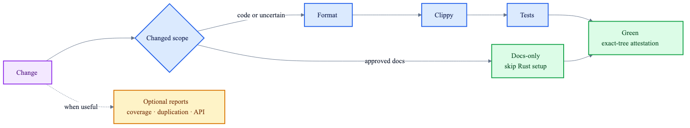

# Agent Development Workflow

Crab uses a small edit/validate loop:

```text
make doctor  ->  make check  ->  make quality
preflight        edit loop       handoff attestation
```



Bare `make` prints help. Workflow scripts use exit `0` for success, `1` for a check failure, and
`2` for a usage, environment, or stale-attestation error.

## Required checks

Only three checks block handoff and CI:

1. `cargo fmt --all -- --check`
2. Crab's ordered Clippy policy
3. Rust tests

`make check` runs those checks over the changed packages and all reverse workspace dependents.
`make quality` runs them over the full workspace and writes an exact-tree attestation to
`quality/status.json`.

This keeps the required path focused on executable correctness. Coverage percentage, duplication,
public-API wiring, and workflow-tool analyses are useful diagnostics, but they do not block every
product change.

## Preflight

`make doctor` is read-only and never installs software. The required environment is Git, Python
3.11+, rustup, and the pinned Rust toolchain with rustfmt and Clippy. It also validates the Cargo
target and Git worktree shape.

Optional tools are reported as information rather than failures:

- `cargo-llvm-cov` and `llvm-tools-preview` for coverage reports
- `jscpd` for duplication reports
- ripgrep for public-API analysis
- Node/npm for installing jscpd
- an `origin/main` merge base, which makes changed-scope selection faster

If the merge base is unavailable, `make check` safely selects the full workspace. `make quality`
does not need a merge base.

## Changed-scope edit loop

`make check` obtains changed paths with Git before invoking Cargo. `DRY_RUN=1 make check` prints the
selected scope and exact commands. The default `worktree` mode includes committed, staged,
unstaged, and untracked files relative to the merge base; CI uses
`DIFF_MODE=committed BASE_SHA=<sha>`.

Crate edits select the changed crates and every reverse workspace dependent. Workspace manifests,
the lockfile, toolchain, Makefile, CI, `.cargo/`, workflow scripts, unknown code paths, or metadata
failures select the full workspace. Approved Markdown-only changes skip Rust setup and checks.

The selector handles docs-only and full-workspace triggers before Cargo metadata. For crate edits,
it reads `cargo metadata --no-deps --locked --offline` and follows `packages[].dependencies` to add
reverse dependents. Metadata failure records the reason and falls back to the full workspace so the
real compiler diagnostic can surface. Missing-baseline and Git diff failures also run all three
checks against the full workspace, even when no changed paths could be collected; dry-run prints
the fallback reason and full commands. Workspace manifests, `Cargo.lock`, the toolchain, Makefile,
CI, `.cargo/`, and workflow scripts trigger full scope. Unknown code paths also select full scope.
Docs-only classification requires both a documentation suffix (`.md`, `.mdx`, `.rst`, or `.txt`)
and an approved location: `docs/`, `crab/docs/`, `notes/`, or `design/`; or one of the explicitly
approved repository documents (`README.md`, `AGENTS.md`, `CLAUDE.md`, `CONTRIBUTING.md`,
`PHILOSOPHY.md`, `CODE_QUALITY_REPORT.md`, `crab/DESIGN.md`, `crab/WORKSTREAMS.md`,
`.github/pull_request_template.md`). Files under
`crates/`, `scripts/`, `crab/config/`, and unknown/root paths are never inferred to be docs merely
from their suffix. Binary assets under a docs directory are also code-scope inputs.

Compiler warnings and Clippy `correctness`, `suspicious`, and `perf` findings are fatal. Clippy
`style` and `complexity` findings remain visible warnings. `make gate-tests` contains offline
fixtures for the lint and workflow policy and should be run when those tools change.

## Optional diagnostics

These commands are intentionally outside `make quality` and CI:

| Command | Purpose | Blocking policy |
|---|---|---|
| `make coverage` | Fresh full-workspace LCOV | No percentage floor |
| `make coverage-quick` | Fresh changed-package totals | Report only |
| `make coverage-diagnostics` | Uncovered-line locations | Report only |
| `make duplication-check` | Production Rust clone scan | Findings report only |
| `make public-api-check` | Cross-file public API wiring | Explicit invocation only |
| `make gate-tests` | Workflow-tool regression tests | Required when workflow tools change |

`make coverage-gate` remains as a deprecated compatibility alias for `make coverage`. Coverage
still uses a worktree-local target because LLVM instrumentation consumes profile state.

The duplication report excludes tests, ignores clones smaller than 10 lines or 100 tokens, and
uses a relaxed 10% reporting threshold. A jscpd finding exits successfully; tool failures remain
environment errors.

## Worktree-aware build reuse

Build, Clippy, and test commands can share Cargo artifacts across worktrees:

```bash
CRAB_SHARED_TARGET_DIR=/absolute/external/cache make check
```

The cache must be writable, outside all repository worktrees and Git metadata, and not a symlink.
Crab adds a per-repository namespace. An ambient external `CARGO_TARGET_DIR` is rejected so cache
sharing is always explicit.

## Handoff attestation

`make quality` records the full format/Clippy/test outcome, tool versions, Git identity, logs, and
start/end fingerprints. It rejects a tree that changes during validation. Complete logs live under
`quality/logs/`; `VERBOSE=1` streams them.

`make quality-status` verifies that the status contains the exact ordered three-check policy and
still matches the current worktree and index. It returns `1` for a genuine current check failure
and `2` for missing, malformed, invalid, or stale evidence.

## CI

CI has one `quality` job. It classifies docs-only changes immediately after checkout, then runs the
changed-scope format, Clippy, and test checks. The Rust toolchain and actions are pinned; workflow
permissions are read-only and checkout credentials are not persisted.

Coverage no longer re-runs the full test suite under instrumentation in CI. Node, jscpd,
cargo-llvm-cov, LLVM tools, and ripgrep are not installed in the required job.
