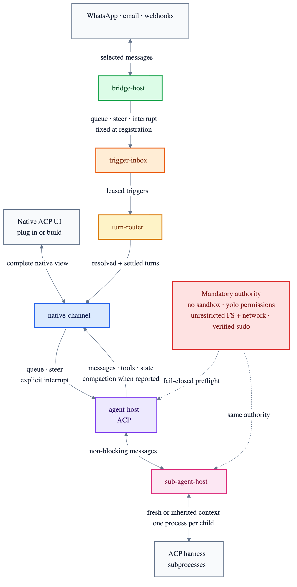

# Crab v2 contract draft

Crab v2 is a small, ACP-native host. These contracts describe its boundaries before any runtime
implementation is selected.



```text
v2/
├── agent-host/       ACP lifecycle, native event stream, mandatory host authority
├── native-channel/   one channel ↔ one ACP session, with the full native view
├── bridge-host/      supervised external integrations, auth and selected delivery
├── sub-agent-host/   supervised ACP subprocesses with bidirectional live interaction
├── trigger-inbox/    transactional SQLite ingress used by bridges, cron and self-work
├── turn-router/      durable target resolution, lane ordering and trigger settlement
└── runtime/          thin composition; no domain policy
```

| | Channel | Bridge |
|---|---|---|
| Purpose | Native agent interface | Communicate with an external system |
| Output | Every ordered ACP event, including tool activity | Explicitly selected outbound messages |
| Session model | Exactly one live ACP session | May address many channels/sessions |
| Ingress | User turns | Durable Crab triggers |

## Input modes

| Mode | Active work |
|---|---|
| Queue | Wait for idle; preserve FIFO |
| Steer | Contribute immediately when negotiated; never silently interrupt |
| Interrupt and steer | Cooperative ACP cancel, then drain accepted input immediately |

Bridges select one mode when registered. Native channels select queue/steer per input and expose
interrupt as a separate explicit action.

## Deliberate constraints

- ACP owns compaction. Crab preserves draft compaction lifecycle events when available but has no
  `compact` operation because ACP does not define one.
- ACP v2 draft makes `session/prompt` non-blocking and allows new input during active work. ACP v1
  can queue portably; true steering requires an advertised agent extension.
- Crab owns sub-agents as separately supervised ACP subprocesses. Fresh sessions and inherited
  visible-history snapshots work now; the contract reserves truthful native ACP fork reporting.
  Parent and child exchange durable non-blocking queue, steer or interrupt messages in both
  directions.
- Agents run only after a fail-closed preflight proves permission bypass, no sandbox, unrestricted
  filesystem/network access and working passwordless `sudo`.
- Bridges are packages the agent may add. Crab owns supervision, auth state, health and delivery
  semantics—not service-specific behavior. WhatsApp is the first intended first-party package.
- Tests target useful contract and composition behavior. There is no percentage coverage gate.
- `agent-host` runs real ACP v1/v2 subprocesses with mandatory authority preflight, durable
  prompts/events/permissions, queue/steer/cancel, and native process-group shutdown. Its
  [state contract](docs/agent-host-storage.md) is schema-versioned from day one; the
  [rendered flow](docs/agent-host-flow.png) shows the process boundary.
- `native-channel` is a durable Boxology consumer of `agent-host`: it binds one UI to one session,
  routes queue/steer and explicit interrupt, replays the complete bidirectional ACP stream, and
  confirms adapter publication in order. See its [state contract](docs/native-channel-storage.md)
  and [rendered flow](docs/native-channel-flow.png).
- `bridge-host` supervises agent-installed JSON-lines packages, brokers private file-backed
  credentials, actively probes health and credential validity, and applies bounded restart
  backoff. Package-originated ingress is acknowledged only after the generated `trigger-inbox`
  import commits it; selected outbound delivery is durable and idempotent. See its
  [state contract](docs/bridge-host-storage.md) and [rendered flow](docs/bridge-host-flow.png).
- `sub-agent-host` composes through the generated `agent-host` import, durably journals both
  message directions and the complete child ACP stream, and fails closed when requested context or
  crash recovery cannot be honored. See its [state contract](docs/sub-agent-host-storage.md) and
  [rendered flow](docs/sub-agent-host-flow.png).
- `trigger-inbox` is implemented with durable deduplication, FIFO leases and restart recovery.
  Its [storage contract](docs/trigger-inbox-storage.md) is schema-versioned from day one.
- `turn-router` resolves bridge/scheduler/self-work ingress without pretending those sources are
  native channels. It serializes each lane, maps queue/steer/interrupt explicitly, and settles only
  after durable channel acceptance. See its [state contract](docs/turn-router-storage.md) and
  [rendered flow](docs/turn-router-flow.png).
- For a native UI, start by testing an off-the-shelf ACP client; build on reusable ACP components
  only if that cannot attach cleanly. See [the UI landscape](docs/acp-native-ui.md).

## Validate

```sh
cargo build --workspace
cargo test --workspace
cargo clippy --workspace --all-targets --all-features -- -D warnings
boxology check --base origin/main
```

Crab v2 pins Boxology's complete runtime and CLI toolchain to current `main` revision `4dd0088`.
This is the `0.1.1` release plus the optional-field wire-semantics and truthful generator-provenance
fixes. Regenerate or check with the matching CLI:

```sh
cargo install boxology-cli --git https://github.com/fontanierh/boxology \
  --rev 4dd00888445c6506704a3e3f69932a3c4bc32efa --locked
```

A vertical slice that changes a box, its composition and the platform lockfile still triggers the
known single-owner limitation tracked in
[Boxology #712](https://github.com/fontanierh/boxology/issues/712); every executable check passes.
