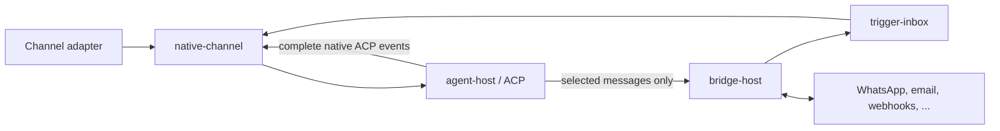

# Crab v2 contract draft

Crab v2 is a small, ACP-native host. These contracts describe its boundaries before any runtime
implementation is selected.



```text
v2/
├── agent-host/       ACP lifecycle, native event stream, mandatory host authority
├── native-channel/   one channel ↔ one ACP session, with the full native view
├── bridge-host/      supervised external integrations, auth and selected delivery
├── trigger-inbox/    durable at-least-once ingress used by bridges, cron and self-work
└── runtime/          thin composition; no domain policy
```

| | Channel | Bridge |
|---|---|---|
| Purpose | Native agent interface | Communicate with an external system |
| Output | Every ordered ACP event, including tool activity | Explicitly selected outbound messages |
| Session model | Exactly one live ACP session | May address many channels/sessions |
| Ingress | User turns | Durable Crab triggers |

## Deliberate constraints

- ACP owns context management and compaction. Crab can open a fresh session; it cannot compact one.
- Agents run only after a fail-closed preflight proves permission bypass, no sandbox, unrestricted
  filesystem/network access and working passwordless `sudo`.
- Bridges are packages the agent may add. Crab owns supervision, auth state, health and delivery
  semantics—not service-specific behavior. WhatsApp is the first intended first-party package.
- Tests target useful contract and composition behavior. There is no percentage coverage gate.
- Implementations in this draft return an explicit `DraftOnly` error; they do not fake a runtime.

## Validate

```sh
cargo build --workspace
cargo test --workspace
cargo clippy --workspace --all-targets --all-features -- -D warnings
GIT_CEILING_DIRECTORIES="$(git rev-parse --show-toplevel)" boxology check
```

The Git ceiling is a temporary workaround for
[Boxology #671](https://github.com/fontanierh/boxology/issues/671). Boxology currently also reports
formatted generated Rust as stale due to
[#677](https://github.com/fontanierh/boxology/issues/677); all other check stages pass. The checked-in
artifacts favor `rustfmt` until the generator is fixed.
