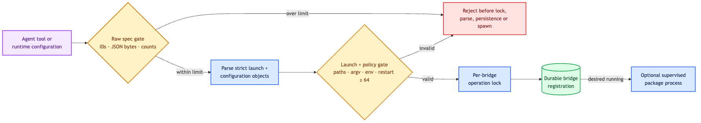

# Bridge host

`bridge-host` owns generic external-message admission, durable ingress routing and selected
delivery. Service packages never bypass its identity, JSON or attachment limits.

## Registration boundary

Raw bridge specs are byte- and count-bounded before the bridge ID enters the per-bridge lock
registry. The host then parses strict launch/configuration objects and checks launch paths, argv,
environment names, authentication methods and restart policy before persistence or process launch.

| Boundary | Maximum |
|---|---:|
| Bridge / package identity | 512 bytes |
| Display name | 1,024 bytes |
| Launch / configuration JSON | 256 KiB / 1 MiB |
| Authentication methods | 6 unique known methods |
| Executable / working-directory path | 4,096 bytes |
| Launch arguments | 64 × 4,096 bytes |
| Environment names | 128 × 255 bytes |
| Process starts per restart window | 64 |

Registration validates path shape without requiring a stopped package to be running. Actual launch
also requires the configured working directory to exist.

## Message boundary

Inbound and outbound messages are byte- and count-bounded before bridge locking, JSON parsing,
attachment ownership checks, fingerprinting or persistence. The final normalized inbound trigger
is rechecked against the trigger inbox ceiling.

| Boundary | Maximum |
|---|---:|
| Bridge / channel identity | 512 bytes |
| Event, message or idempotency identity | 1,024 bytes |
| Sender or destination JSON | 64 KiB |
| Message JSON | 896 KiB |
| Normalized inbound trigger | 1 MiB |
| Attachments | 64 |
| Media type / name / content handle | 255 / 1,024 / 4,096 bytes |
