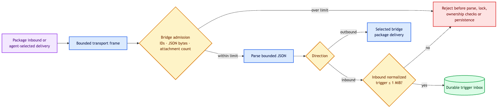

# Bridge host

`bridge-host` owns generic external-message admission, durable ingress routing and selected
delivery. Service packages never bypass its identity, JSON or attachment limits.

Inbound and outbound messages are byte- and count-bounded before bridge locking, JSON parsing,
attachment ownership checks, fingerprinting or persistence. The final normalized inbound trigger
is rechecked against the trigger inbox ceiling.

| Boundary | Maximum |
|---|---:|
| Bridge / channel identity | 512 bytes |
| Event, message or idempotency identity | 1,024 bytes |
| Sender or destination JSON | 64 KiB |
| Message JSON | 896 KiB |
| Normalized inbound trigger | 1 MiB |
| Attachments | 64 |
| Media type / name / content handle | 255 / 1,024 / 4,096 bytes |
