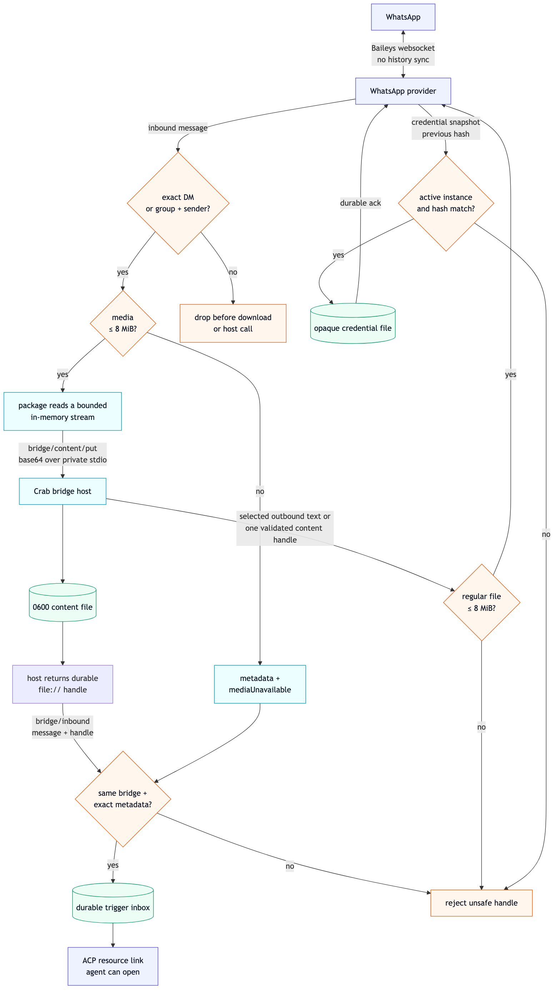

# WhatsApp bridge provider

First-party protocol-v2 package for Crab's bridge host. It uses Baileys, speaks newline-delimited
JSON-RPC on stdio, and never stores credentials or message content itself.



## Runtime shape

```text
WhatsApp
   ↕ Baileys websocket
this package
   ↕ bridge protocol v2 over stdio
Crab bridge host
   ├── opaque credential files
   └── durable trigger inbox
```

The package supports `qrCode` and `phoneCode` authentication. Configuration is strict:

```json
{
  "targetChannelId": "primary",
  "browserName": "Crab",
  "inboundPolicy": {
    "directChatIds": ["33123456789@s.whatsapp.net", "opaque-user@lid"],
    "groups": [{
      "chatId": "123456789@g.us",
      "senderIds": ["33123456789@s.whatsapp.net", "opaque-user@lid"]
    }]
  }
}
```

Inbound authorization is exact and fail-closed. Missing or empty `inboundPolicy` denies every
message. A direct message must match `directChatIds`. A group message must match both one group
`chatId` and one of that rule's `senderIds`; listing a group as a direct chat is rejected. Baileys
primary and alternate JIDs are both checked, but no wildcard or display-name match exists.
Unauthorized traffic is discarded before media download or any host call.

Outbound delivery accepts selected text or one host-owned attachment with `destination.chatId`.
Image, video and document payloads may carry a caption; audio and sticker payloads remain native
captionless messages. The provider reads only regular `file://` content handles, caps reads at
8 MiB, and rejects missing, changing, ambiguous or multi-attachment requests. Crab's idempotency
key becomes a deterministic WhatsApp message ID, so a retry uses the same external ID.

Inbound image, video, audio, document and sticker streams are capped at 8 MiB and sent directly to
the host's private content store before trigger acknowledgement. The package never chooses a path
or writes local media. Crab returns a durable `file://` handle which becomes an ACP resource link;
only the originating bridge can attach it with the exact stored metadata. Oversized, failed, or
unstorable downloads preserve their message metadata with a truthful `mediaUnavailable` reason.
Full history is never synchronized.

## Credential safety

The package holds one complete Baileys authentication snapshot in memory. After initial pairing,
Crab first stores that snapshot and calls `bridge/auth/committed`. Later Signal key changes use:

```text
previous SHA-256 → complete fresh snapshot → durable host ack → next mutation
```

An update rejection is fatal. The host then restarts the package from its last acknowledged
snapshot instead of continuing with memory-only Signal state.

## Development

```bash
npm install
npm test
```

`@whiskeysockets/baileys` is pinned exactly. Upgrade it deliberately and rerun the protocol,
restart, credential-refresh, inbound, and delivery tests.

Boxology currently lacks the semantically correct `provider` package kind, so the manifest uses a
documented `platform` compatibility classification until
[Boxology #717](https://github.com/fontanierh/boxology/issues/717) lands.
