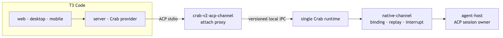
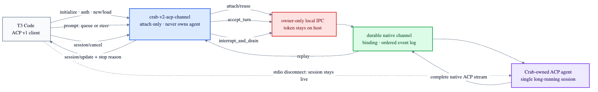

# ACP native UI

## Decision

Use the MIT-licensed [T3 Code](https://github.com/pingdotgg/t3code) as Crab's first native UI and
maintain the integration in the [Crab fork](https://github.com/fontanierh/t3code). T3 supplies mature
web, desktop, mobile and remote clients; Crab remains the only owner of agent sessions and processes.



The decision was validated against `pingdotgg/t3code@a3a8cbd` and
`deepseek-ai/deepseek-harness@b150a55` on 2026-08-26.

## Fit

| Candidate | Reusable strengths | Blocking mismatch |
|---|---|---|
| T3 Code | Multi-surface product, remote transport, rich tool/session UI, reusable ACP client runtime and provider drivers | ACP providers currently own their subprocesses; active follow-ups do not expose Crab's explicit queue/steer choice |
| DeepSeek Harness | Rich plugin UI and a tested ACP agent server | Its ACP endpoint is explicitly automation-only and its UI is coupled to the DeepSeek Harness runtime |
| ACP UI | Direct ACP client with a smaller integration surface | Less complete remote/mobile control surface than T3 Code |
| acp-components | Good typed components for a future custom client | Requires Crab to own and finish the surrounding product |

## Attach seam

The T3 Crab provider starts one lightweight `crab-v2-acp-channel` process per T3 thread. That process
speaks standard ACP over stdio, but only attaches to the single long-running Crab runtime over a
versioned local IPC transport. It must never launch or own the underlying ACP agent.

The authenticated local Boxology transport and ACP stdio facade are implemented. The remaining
integration is T3 provider wiring.



| T3 / ACP operation | Crab operation |
|---|---|
| `session/new`, `session/load`, `session/resume` | Create or attach one durable native-channel binding |
| `session/prompt` in queue mode | `accept_turn(Queue)` |
| `session/prompt` in steer mode | `accept_turn(Steer)` |
| `session/cancel` | `interrupt_and_drain` |
| `session/update` | Lossless ordered native-channel replay with facade session IDs |

T3 launches:

```text
crab-v2-acp-channel
├── --state-dir <Crab state>
├── --agent <configured agent ID>
├── --adapter t3code
└── --bootstrap-file <optional prompt>
```

The facade advertises the `crab-local` ACP authentication method; the actual credential remains the
owner-only IPC token loaded inside the process. Prompts default to queue mode. The T3 provider can
set `_meta.crab.inputMode` to `queue` or `steer`, and `_meta.crab.turnId` to a durable idempotency
key. Interrupt remains the standard `session/cancel` action.

Queue and steer must be separate UI actions or an explicit composer mode. Interrupt remains a
separate action. The proxy may rewrite transport-local request and session IDs, but it must retain
every native agent update needed to render thoughts, plans, tools, terminals, diffs, usage and
compaction. Credentials never cross this seam.

T3 provider work remains tracked in [Crab #206](https://github.com/fontanierh/crab/issues/206).
