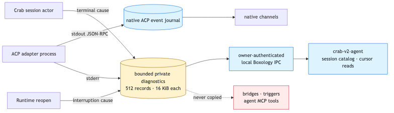

# Private agent diagnostics

ACP stdin/stdout remains the lossless native channel stream. Adapter stderr and Crab-authored
terminal causes are a separate owner-only operator journal because stderr may contain sensitive
process detail and is not an ACP event.



```text
agent-host.sqlite
├── events       complete native ACP stdin/stdout → channels
└── diagnostics  bounded adapter stderr + terminal causes → operator CLI only
```

Each session retains its newest 512 diagnostic records; each message is capped at 16 KiB. Sequence
numbers never rewind when old records expire. Cursor responses report the oldest retained sequence
so an operator can detect a retention gap. Reopening a session that never detached records an
explicit restart-interruption cause before marking it failed.

The authenticated operator path is:

```sh
crab-v2-agent --state-dir /private/path/to/crab-v2-state status <session-id>
crab-v2-agent --state-dir /private/path/to/crab-v2-state list 100
crab-v2-agent --state-dir /private/path/to/crab-v2-state \
  diagnostics <session-id> <after-sequence> <limit>
```

Diagnostic output is explicit and potentially sensitive. It is never projected into native-channel
replay, bridge output, trigger ingress, or either first-party agent MCP server.
