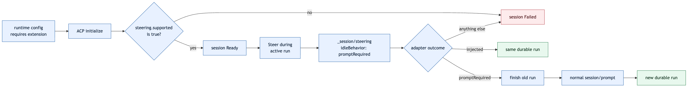
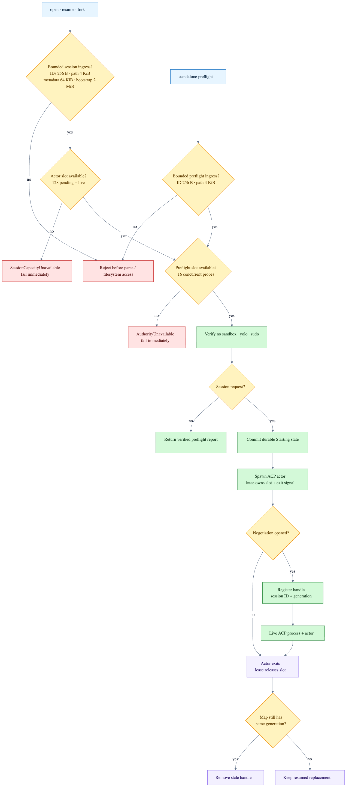

# Agent host state

`agent-host` owns one SQLite database and one in-memory actor per live ACP session. The actor owns
the connection to exactly one supervised ACP subprocess; queued prompt payloads live only in the
database, which is also the durable operator/UI view.

## Schema lifecycle

- `PRAGMA user_version = 3` creates `sessions`, `prompts`, `events`, `permissions`, and private
  `diagnostics` atomically.
- Schema v1 migrates additively: prompts gain nullable `interrupted_run_id` and
  `cancel_requested_at_ms` receipt fields.
- Schema v2 migrates additively: sessions gain a diagnostic cursor and the bounded diagnostics
  journal is created.
- WAL mode, foreign keys, a five-second busy timeout, and full synchronous writes are mandatory.
- Unknown schema versions fail closed with `StorageUnavailable`.
- A process cannot survive a Crab restart. Reopening marks `Starting`, `Ready`, `Busy`, `Detaching`
  or `Stopping` sessions and their unfinished prompts as `Failed`; their native events remain
  readable. Graceful shutdown commits `Detached` instead, which remains eligible for explicit
  [native resume](agent-session-resume.md) without changing either identity or replaying Crab
  bootstrap context.

## Durable invariants

- `(session_id, client_turn_id)` deduplicates one immutable prompt; a changed retry is rejected.
- `native_prompt_json` is the exact JSON array carried in ACP's `prompt` field. Every native
  ingress rejects payloads over 2 MiB before JSON parsing or durable storage; larger media uses
  resource links or content handles.
- Native stdin/stdout JSON-RPC lines are stored byte-for-byte with direction and per-session order.
  Agent stdout is framed before parsing or journaling with a 16 MiB per-line ceiling; overflow
  fails the transport and tears down its process group instead of growing memory without bound.
- Adapter stderr never becomes a native event. The newest 512 private diagnostics per session are
  retained separately with 16 KiB message caps and monotonic cursors; explicit operator reads are
  described in [Private agent diagnostics](agent-diagnostics.md).
- Every accepted run ends with exactly one `RunFinished` event. A native ACP terminal response or
  idle update remains authoritative; if a prompt instead returns a JSON-RPC error, Crab preserves
  that error and atomically appends a minimal `crab/run_finished` lifecycle notification before
  clearing the active run.
- SQLite is the live prompt FIFO, not a shadow in-memory queue. The actor loads only the next
  committed prompt at a turn boundary, and queued cancellation updates the same durable row.
- One 30-second control deadline covers per-session serialization, admission to the bounded actor
  queue and the actor receipt. A stalled actor therefore cannot hold prompt, cancel, close or
  runtime detach forever.
- One host-wide budget admits at most 128 pending or live ACP session actors across open, resume and
  fork. Exhaustion fails immediately with `SessionCapacityUnavailable`. The actor lease owns its
  slot until actual task exit; exit then reaps only the matching handle generation, so delayed
  cleanup cannot remove a resumed replacement.
- Authority verification admits at most 16 concurrent probes and fails fast with
  `AuthorityUnavailable`. Before parsing, filesystem access or storage, the host caps identifiers
  and turn keys at 256 bytes, absolute working directories at 4 KiB, session metadata at 64 KiB and
  bootstrap prompts at 2 MiB.
- ACP v1 has one foreground run; queued prompts drain FIFO after its prompt response. A configured
  `_session/steering` extension may contribute to that run only after `initialize` advertises it.
  Crab requests `promptRequired` on an idle race and starts the continuation itself through normal
  `session/prompt`, so no detached turn escapes the durable lifecycle.
- ACP v2 steering contributes to the active run; queued prompts wait for an `idle` state update.
- `InterruptAndQueue` is one session-actor operation. When busy, Crab requests cooperative cancel,
  durably queues the immutable input with its interrupted-run receipt before processing completion,
  then drains FIFO. Exact retries return that receipt without cancelling again.
- Permission requests and the automatically selected strongest allow response are audit records,
  never human-gated work.
- Configured stdio MCP declarations are attached to every `session/new` and `session/resume`. Crab
  injects canonical state/workspace paths and session identity; draft ACP v2 must advertise
  `session.mcp.stdio`.
- Host-wide detach attempts every live session concurrently under that control deadline, cancels
  active work, waits for acknowledgement, fails unfinished prompts and tears down ACP process
  groups without sending `session/close`.
- Explicit close sends native `session/close`, commits `Stopped` and is never resumable.

