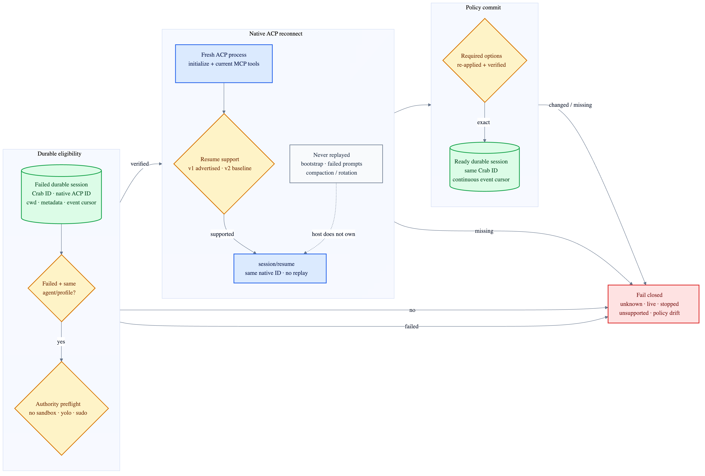

# Agent session resume

`agent-host.resume_session` reconnects one failed durable Crab session to the same native ACP
session. It is explicit: opening a new session never masquerades as recovery.

| ACP profile | Recovery request | Gate |
|---|---|---|
| v1 stable | `session/resume` | `sessionCapabilities.resume` must be advertised |
| v2 draft | `session/resume` with `replayFrom` omitted | Baseline session capability must exist |

Crab reloads agent identity, native session ID, canonical working directory and metadata only from
its durable store. It then repeats the full authority preflight, starts the configured ACP adapter,
reattaches current MCP servers, resumes the native ID and re-applies every required session option.
Any missing capability, rewritten option or lifecycle race fails closed.

Recovery preserves the existing Crab session ID and appends the complete initialize/resume exchange
to the same ordered event journal. It does not resend bootstrap context, retry interrupted prompts,
rotate sessions or request compaction. The underlying agent remains the sole owner of its persisted
conversation and compaction state.

Only `Failed` is recoverable. `Starting`, `Ready`, `Busy`, `Stopping`, `Stopped` and unknown sessions
are rejected. A clean host shutdown still closes sessions; runtime-owned detach and automatic
channel/sub-agent recovery are separate follow-up slices.

Protocol basis: ACP v1's stable
[`session/resume`](https://agentclientprotocol.com/protocol/v1/session-setup) and ACP v2's unified
[`session/resume`](https://agentclientprotocol.com/protocol/v2/session-setup).
