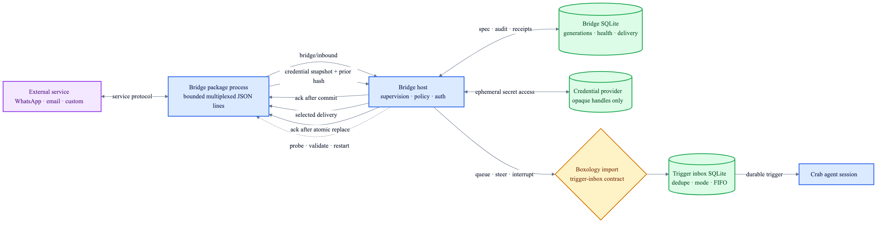

# Bridge host state and package protocol

`bridge-host` owns bridge lifecycle, policy, authentication references, health, inbound audit and
selected outbound delivery. Service-specific behavior stays in agent-installable subprocesses.



## Durable layout

```text
runtime-state/
├── bridge-host.sqlite       specs, generations, health, auth metadata, ingress, deliveries
├── bridge-credentials/      opaque-handle JSON files; directory 0700, files 0600
└── bridge-content/          host-named media + metadata; directory 0700, files 0600
```

- SQLite schema v1 uses WAL, foreign keys, full synchronous writes and fail-closed version checks.
- A bridge ID has one immutable generation. Package, configuration or ingress-mode changes use
  compare-and-swap replacement and append a generation audit row.
- Runtime restart preserves desired state and credential handles, invalidates stale health and
  pending challenges, then restarts desired packages under their configured budget.
- Credential bytes never enter SQLite, errors or debug output. The host actively revalidates the
  opaque handle at the registered interval. Renderable authentication challenges are returned to
  the caller, while SQLite retains only challenge metadata—not QR or response payloads.
- Inbound deduplication is `(bridge_id, external_event_id)`; acknowledgement follows durable
  `trigger-inbox.enqueue`. The registered generation—not the event—selects queue, steer or
  interrupt-and-steer.
- Content uploads are capped at 8 MiB and deterministically deduplicated by bridge, external event,
  metadata and bytes. The host chooses the private path and returns a percent-encoded `file://`
  handle. Ingress accepts that handle only for the originating bridge with the exact stored media
  type/name and rechecks the file size/hash before it becomes an ACP resource link.
- Outbound deduplication is `(bridge_id, message_id)` with a stable package idempotency key.

## Process protocol

Each package is an absolute executable speaking protocol v2 as bounded JSON-RPC-style messages,
one JSON object per line. Crab clears the child environment, passes only explicitly named
variables, and fails launch when a named variable is unavailable.

| Direction | Methods |
|---|---|
| Host → package | `bridge/initialize`, `bridge/health`, `bridge/auth/*`, `bridge/deliver`, `bridge/shutdown` |
| Package → host | `bridge/content/put`, `bridge/inbound`, `bridge/credential/update` |

The transport multiplexes responses and ordered inbound calls without blocking health or delivery
RPCs. Media bytes cross only the private bounded stdio protocol: `bridge/content/put` fsyncs content
before returning its handle, and `bridge/inbound` receives success only after durable trigger
enqueue. Both operations are idempotent for a retried external event.

Authentication completion is two-phase: Crab stores the initial secret under an opaque handle,
then `bridge/auth/committed` permits live credential updates. Each update supplies the previous
canonical-JSON SHA-256 fingerprint. Crab accepts it only from the active package instance, compares
the current fingerprint, atomically replaces and fsyncs the same mode-0600 credential file, then
returns the new fingerprint. Stale processes and out-of-order snapshots fail without secret-bearing
diagnostics.

Crab terminates the package process group on stop/drop, probes immediately and on every health
interval, applies exponential backoff, and refuses starts beyond the configured restart window.
