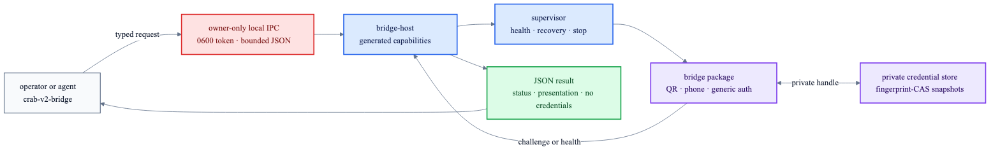

# Bridge operations

`crab-v2-bridge` is the typed operator client for the running Crab process. It reads the owner-only
IPC token, calls generated `bridge-host` capabilities, and prints one JSON object to stdout.



```text
runtime composition/
└── crab-v2-bridge
    ├── catalog + status
    ├── reconcile + suspend + stop
    ├── auth challenge presentation
    └── credential validate + invalidate
         └── owner-only IPC → bridge-host → private credential store
```

Set the state directory once in the examples below:

```sh
CRAB_V2_STATE=/private/path/to/crab-v2-state
crab-v2-bridge --state-dir "$CRAB_V2_STATE" list
crab-v2-bridge --state-dir "$CRAB_V2_STATE" status whatsapp
```

Catalog entries expose `management` as `runtime-configured` or `agent-managed`, making restart and
static-removal behavior inspectable without opening the state database.

## Authenticate

Begin QR authentication, scan the returned `presentation.value`, then tell the package the external
step is complete:

```sh
crab-v2-bridge --state-dir "$CRAB_V2_STATE" \
  auth-begin whatsapp qr-code '{}'
crab-v2-bridge --state-dir "$CRAB_V2_STATE" \
  auth-submit whatsapp <challenge-id> empty
```

For phone pairing, the returned presentation contains the code to enter in the service UI:

```sh
crab-v2-bridge --state-dir "$CRAB_V2_STATE" \
  auth-begin whatsapp phone-code '{"phoneNumber":"<international-number>"}'
crab-v2-bridge --state-dir "$CRAB_V2_STATE" \
  auth-submit whatsapp <challenge-id> empty
```

Packages that require a secret response accept one bounded JSON object through stdin. Secret input
is deliberately rejected as an argument so it does not enter shell history or the process list.

```sh
secret-source | crab-v2-bridge --state-dir "$CRAB_V2_STATE" \
  auth-submit <bridge> <challenge-id> stdin
```

Challenge presentations are ephemeral operator output. Credential material stays in the private
bridge credential store; CLI results expose only lifecycle metadata and `credentialStored`.

## Recover or stop

```sh
crab-v2-bridge --state-dir "$CRAB_V2_STATE" credentials-validate whatsapp
crab-v2-bridge --state-dir "$CRAB_V2_STATE" credentials-invalidate whatsapp
crab-v2-bridge --state-dir "$CRAB_V2_STATE" reconcile whatsapp <generation> true
crab-v2-bridge --state-dir "$CRAB_V2_STATE" suspend whatsapp
crab-v2-bridge --state-dir "$CRAB_V2_STATE" stop whatsapp
```

`suspend` halts the current process while preserving desired state. `reconcile` applies the declared
generation and desired state through the supervisor. `stop` durably disables the bridge. Domain
failures retain their stable Boxology code on stderr and return a non-zero status.

ACP agents receive the broader install, generation, authentication and selected-delivery lifecycle
through the first-party [native bridge tools](native-bridge-tools.md). Both surfaces share this
owner-only IPC and the same generated `bridge-host` capabilities.
