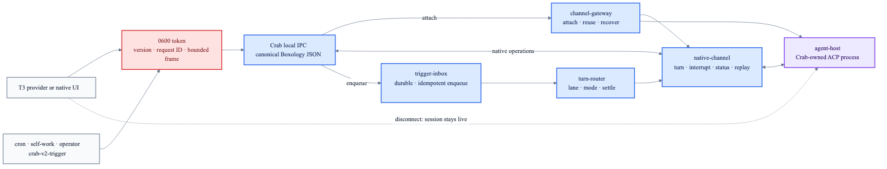

# Local capability IPC

The long-running Crab runtime exposes selected generated Boxology capabilities through one local
Unix socket. UI adapters attach without inheriting agent ownership; trigger producers and bridge
operators never open Crab's databases or credential store.

| Wire capability | Boxology owner |
|---|---|
| `channel-gateway.attach_channel` | `channel-gateway` |
| `native-channel.accept_turn` | `native-channel` |
| `native-channel.interrupt_and_drain` | `native-channel` |
| `native-channel.channel_status` | `native-channel` |
| `native-channel.replay_native_events` | `native-channel` |
| `trigger-inbox.enqueue` | `trigger-inbox` |
| `bridge-host.list_bridges` | `bridge-host` |
| `bridge-host.reconcile_bridge` | `bridge-host` |
| `bridge-host.begin_authentication` | `bridge-host` |
| `bridge-host.submit_authentication` | `bridge-host` |
| `bridge-host.validate_credentials` | `bridge-host` |
| `bridge-host.invalidate_credentials` | `bridge-host` |
| `bridge-host.bridge_status` | `bridge-host` |
| `bridge-host.suspend_bridge` | `bridge-host` |
| `bridge-host.stop_bridge` | `bridge-host` |
| `sub-agent-host.spawn` | `sub-agent-host` |
| `sub-agent-host.send_to_child` | `sub-agent-host` |
| `sub-agent-host.send_to_parent` | `sub-agent-host` |
| `sub-agent-host.read_events` | `sub-agent-host` |
| `sub-agent-host.status` | `sub-agent-host` |
| `sub-agent-host.stop` | `sub-agent-host` |

## Boundary

- `channel-ipc.sock` and `channel-ipc.token` are mode `0600` beneath the canonical state directory.
- The 256-bit token survives runtime restarts; a malformed, symlinked or group/world-accessible
  token fails startup.
- Each request is one bounded JSON line with protocol version, request ID, authentication,
  qualified capability and canonical Boxology JSON input. Unknown fields and capabilities fail
  closed.
- Responses preserve Boxology domain-error tags and canonical contract output. The bridge CLI
  exposes auth presentations but never credential handles or material.
- Client disconnect only closes that transport connection. Session replacement and shutdown remain
  explicit Crab operations.
- The token is loaded from the state directory by the local client. It never appears in CLI
  arguments, output or trigger records.

See [bridge operations](bridge-operations.md) and
[realtime sub-agent control](sub-agent-control.md) for the typed operator workflows.
