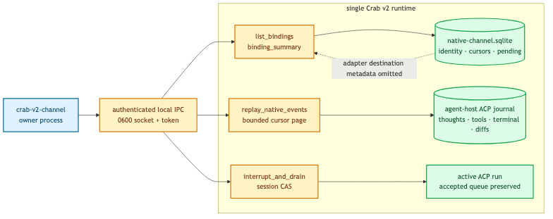

# Native channel operations

`crab-v2-channel` is the owner-only operator view of durable native channels. It reads the local
IPC token and calls generated Boxology capabilities; it never opens SQLite or launches an agent.



```text
crab-v2-channel
├── list <limit>                         newest durable bindings
├── status <binding>                     one binding, including pending work
├── events <binding> <cursor> <limit>    exact native ACP JSON
└── interrupt <binding> <session> <why>  explicit cooperative cancellation
```

The catalog is bounded to 256 records, includes detached and failed bindings, and sorts by newest
durable update. It excludes `native_channel_json`, so service-specific destination metadata is not
copied into routine discovery output. `status` remains available when the ACP process is down.

Event pages are bounded to 256 and retain the exact ACP JSON string, including thoughts, tools,
terminal activity, diffs, usage and compaction lifecycle updates. Durable history remains readable
while a binding is failed or detached. Interrupt requires the expected session ID from the catalog;
a concurrent replacement fails with `SessionMismatch`. It cancels only the active run and preserves
every already accepted Queue or Steer input.

```sh
crab-v2-channel --state-dir /private/path/to/state list 100
crab-v2-channel --state-dir /private/path/to/state status <binding-id>
crab-v2-channel --state-dir /private/path/to/state events <binding-id> 0 100
crab-v2-channel --state-dir /private/path/to/state \
  interrupt <binding-id> <expected-session-id> "operator requested"
```

The Unix socket and token are mode `0600`. Raw ACP events may contain sensitive content and are
emitted only for an explicit owner request.
