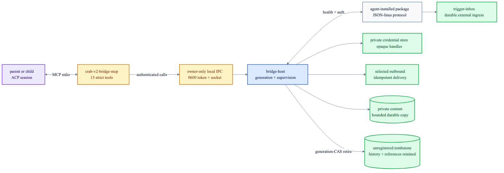

# Native bridge tools

Crab attaches `crab-v2-bridge-mcp` to every configured ACP session. Parents and children can extend
the harness by writing a bridge package, registering its absolute entrypoint, authenticating it,
and operating it through generic `bridge-host` supervision.



```text
crab-v2-bridge-mcp
├── package        register · replace · list
├── lifecycle      reconcile · status · suspend · stop
├── authentication begin · submit · validate · invalidate
└── selected output import local content · deliver · delivery status
```

Registration is strict and secret-free: executable and working-directory paths are absolute,
environment variables are referenced only by name, configuration is structured JSON, ingress mode
and the optional `{channelId, lane}` alert target are fixed in the immutable generation, and restart
bounds are non-zero. Native registration is durably marked `AgentManaged`, so removing unrelated
runtime JSON cannot stop it and a restart restores its desired state. Alert targets receive
deduplicated incident and recovery turns in queue mode. Start a new package with
`desiredRunning: false`; install and inspect it, then reconcile its current generation to running.

Authentication presentations such as QR images, phone codes, or URLs are ephemeral MCP results.
Crab stores resulting credentials behind a private handle; tool output reveals only whether a
credential exists. Active validation proves the service credential still works.

`deliver_bridge_message` is intentional external communication, not channel mirroring. Its stable
message/idempotency key makes retries safe, and `bridge_delivery_status` reads the durable result.
The native ACP event stream remains exclusive to channels.

`import_bridge_content` accepts one absolute regular file, stable import ID, media type and optional
name. Crab rejects relative paths, symlinks, empty/oversized/changing files, copies at most 8 MiB
into its private content store, and returns the exact bridge-bound attachment object to pass to
`deliver_bridge_message`. Importing alone never communicates externally.
