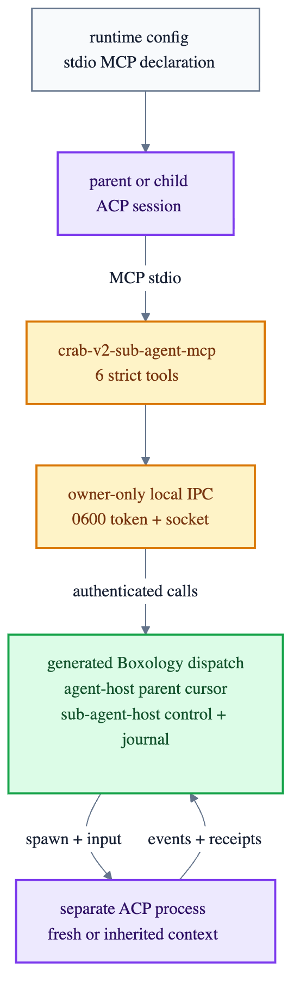

# Native sub-agent tools

Crab attaches `crab-v2-sub-agent-mcp` to every configured ACP session through the standard ACP
stdio-MCP declaration. The agent sees six portable tools; it never receives Crab's IPC token.



```text
runtime config
└── agents[].sessionMcpServers[]
    └── crab-v2-sub-agent-mcp
        ├── spawn_sub_agent
        ├── send_to_sub_agent
        ├── send_to_parent          child sessions only
        ├── read_sub_agent_events
        ├── sub_agent_status
        └── stop_sub_agent
```

ACP v1 requires stdio MCP support. Draft ACP v2 must advertise `session.mcp.stdio`; Crab fails the
session closed when it does not. Each declaration receives only the canonical state/workspace
paths and Crab's agent/session IDs. Child sessions additionally receive their child and parent IDs.
The MCP process then loads the owner-only token itself and calls generated Boxology capabilities
over Crab's local socket.

Calls acknowledge accepted control work rather than waiting for a child model turn. `inherit`
reads the parent's current durable ACP event cursor before spawning; `fresh` starts without parent
history. Input modes remain `queue`, `steer`, and `interrupt-and-steer`.
