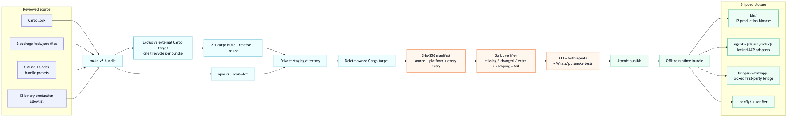
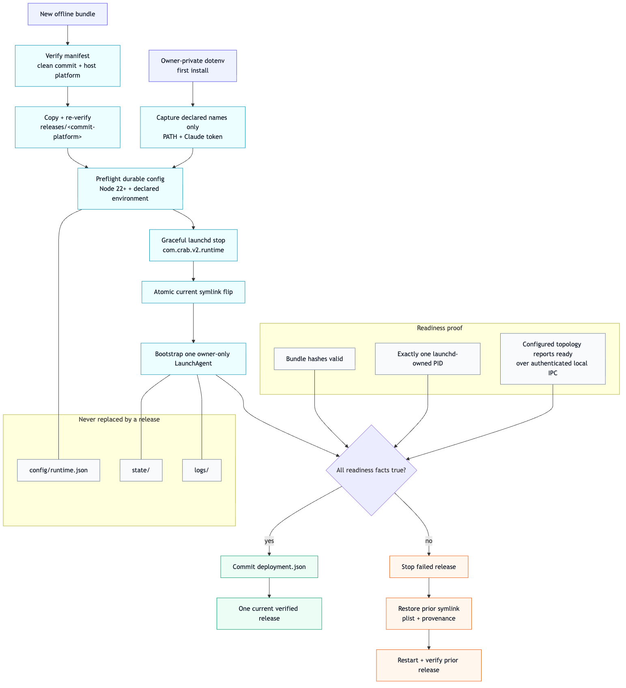

# Verified runtime bundle

`make v2-bundle` is the single release recipe for a clean machine. It creates one
platform-specific directory and refuses a dirty source tree. Development builds require both
`--allow-dirty` and an explicit output path.



```text
crab-v2-<commit>-<platform>/
├── bin/                  twelve production binaries; no test fixtures
├── agents/
│   ├── claude/           Claude ACP adapter 0.70.0 + locked production closure
│   └── codex/            Codex ACP 1.7.0-crab.2 + Codex 0.150.1
├── bridges/whatsapp/     first-party package + locked production closure
├── config/               generic and bundle-relative launch presets
├── libexec/v2_bundle.py  copied, stdlib-only verifier
├── bundle-manifest.json  source/platform provenance + complete entry inventory
└── README.md             verify and launch recipe
```

## Build

```sh
make v2-bundle
```

The builder gives both locked Cargo phases one collision-resistant target outside the checkout and
removes it on success or failure. It uses `npm ci --omit=dev`, stages privately, verifies every
entry, smoke-tests all public CLIs plus the agent and bridge, then publishes with one rename. An
existing output is never overwritten.

## Verify anywhere

```sh
python3 /path/to/bundle/libexec/v2_bundle.py verify /path/to/bundle
```

Verification needs only Python 3. Runtime needs Node 22+, but never Rust, npm, `npx`, an install
step, or a package fetch. The manifest rejects missing, altered, extra, special, absolute-symlink,
and escaping-symlink entries. It does not contain credentials or runtime state.

The supplied launch presets pin either Claude Opus 5 with `bypassPermissions` or Codex GPT-5.6-Sol
with `agent-full-access` and high reasoning. Both verify their vendored adapter without `npx` and
register the bundled WhatsApp bridge in queue mode with QR and phone authentication. Both agents
negotiate `_session/steering`: active input is injected, while an idle race returns the content to
Crab for a normal lifecycle-owned prompt. WhatsApp bridge incidents and recovery target the primary
queue lane. The WhatsApp preset starts with an empty, default-deny inbound policy; exact authorized
DM IDs or group-and-sender pairs belong in the durable runtime config and survive updates. The
first-party authority probes currently make both presets macOS-specific.

## Deploy and update



The bundle's stdlib-only tool is also the only deployment recipe. The first deployment needs an
agent workspace; updates reuse the durable config:

```sh
python3 /path/to/bundle/libexec/v2_bundle.py deploy /path/to/bundle \
  --workspace /absolute/path/to/agent-workspace \
  --environment-file ~/.crab-secrets/crab.env

# Or select Codex on first deployment (Claude is the default):
python3 /path/to/bundle/libexec/v2_bundle.py deploy /path/to/bundle \
  --workspace /absolute/path/to/agent-workspace \
  --agent codex

python3 /path/to/new-bundle/libexec/v2_bundle.py deploy /path/to/new-bundle
```

```text
~/.crab-v2/
├── releases/<commit>-<platform>/  immutable, verified release closures
├── current -> releases/<release>  the only release switch
├── bin -> current/bin             stable launch and operator paths
├── agents -> current/agents
├── bridges -> current/bridges
├── libexec -> current/libexec
├── config/runtime.json            durable owner-only topology
├── state/                         durable owner-only runtime state
├── logs/                          launchd stdout and stderr
├── deployment.json                active source/release provenance
└── deploy.lock                    rejects concurrent updates
```

`--agent` is accepted only while creating the durable config; updates always preserve that config.
Codex reuses its user-owned ChatGPT authentication. Claude's first deployment requires
`CLAUDE_CODE_OAUTH_TOKEN`; later updates reuse the captured value when it is unavailable.

The command verifies both source and copied bundles, requires a clean host-matching release,
captures only config-declared environment names from the ambient process and an optional
owner-private environment file, and preserves unavailable values from the prior owner-only
LaunchAgent. It then gracefully stops
`com.crab.v2.runtime`, atomically flips `current`, and proves all three readiness facts: the
manifest still verifies, launchd owns the only `crab-v2` PID, and the owner-authenticated health
surface reports the configured topology as ready with the same semantic-config fingerprint and
launchd PID. A failure at any point after cutover restores the prior symlink, plist, provenance and
process, then verifies that rollback.

The deploy deadline also bounds each health subprocess using only its remaining budget. `status`
uses an independent ten-second health deadline. A socket peer that accepts but stops responding can
therefore degrade health, but cannot suspend deployment rollback or operator status indefinitely.

```sh
python3 ~/.crab-v2/libexec/v2_bundle.py status
```

Status checks the release, stable links, exact managed plist, provenance, singleton PID and the
configured topology over local IPC. `topologyReady` means a release is structurally usable;
`topologyHealthy` requires every configured channel and desired bridge to be fully healthy. A bridge
awaiting authentication or reporting degradation remains ready, so an update is not rolled back,
but status fails and reports an explicit `needsAction`. Its JSON never includes environment values.
This v2 label and service root are separate from the live v1 `com.crab.runtime` service.

The same evidence is available directly:

```sh
~/.crab-v2/bin/crab-v2-health \
  --config ~/.crab-v2/config/runtime.json \
  --state-dir ~/.crab-v2/state
```

See the [runtime health contract](runtime-health.md) and [rendered flow](runtime-health-flow.png).

`~/.crab-v2/bin/crab-v2-agent` reads bounded session status and private adapter diagnostics through
the same owner-authenticated IPC. It never opens SQLite directly; diagnostic output is emitted only
for an explicit operator request and may contain sensitive stderr.

`~/.crab-v2/bin/crab-v2-channel` discovers durable native bindings, reports pending work, replays
bounded raw ACP event pages and exposes an explicit session-CAS interrupt. Adapter-specific
destination metadata is deliberately absent from its catalog.
