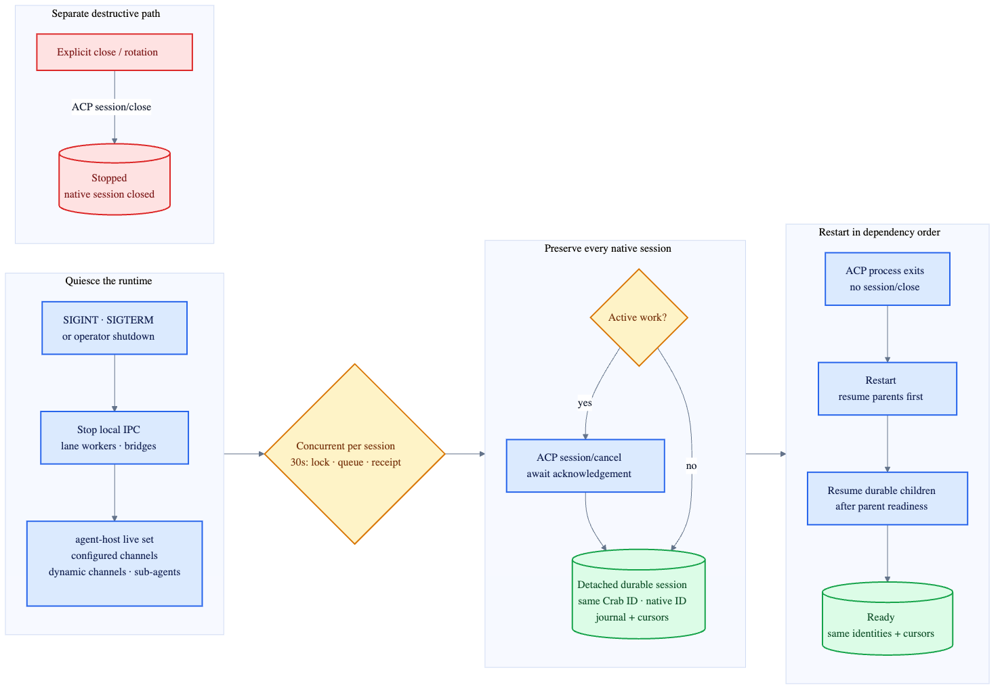

# Graceful runtime detach

Graceful shutdown preserves native ACP sessions. Explicit close remains destructive.

| Operation | Active work | Native session | Restart |
|---|---|---|---|
| Runtime shutdown | Cancel and await acknowledgement | Detached, never closed | Resume exact parent IDs, then child IDs |
| Host/process failure | Mark failed | Recovery depends on agent | Resume exact ID when supported |
| Explicit close/rotation | Cancel if needed | `session/close` | Never resumable |

`agent-host.detach_sessions` owns the complete live-session set. Runtime code does not track a
second list, so configured channels, dynamic IPC attachments and sub-agents cannot be omitted.
Queued and running Crab prompts fail at detach and are never replayed.

All live sessions are attempted concurrently. Each has one 30-second deadline covering control
serialization, bounded actor-queue admission and the detach receipt, so one wedged actor cannot
prevent the remaining sessions from detaching or make shutdown unbounded.

Each successful session moves `Ready|Busy → Detaching → Detached`. If cancellation or transport
drain fails, the session becomes `Failed`, the report names it, and runtime shutdown reports an
error. The durable native identity remains eligible for the same fail-closed resume path.
