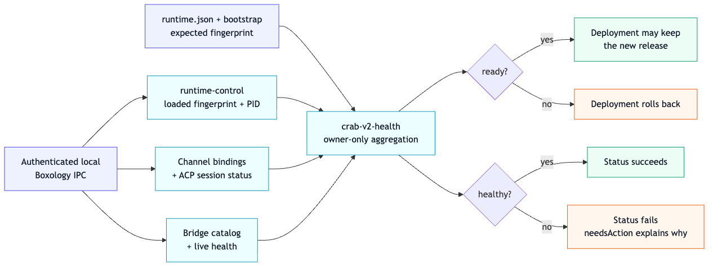

# Configuration-aware runtime health

`crab-v2-health` is the owner-only truth surface for the configured runtime topology. It loads the
durable schema-v1 config, then reads existing channel, ACP-session and bridge capabilities through
authenticated Boxology IPC. The `runtime-control` capability also proves the process loaded that
exact resolved semantic config, including referenced bootstrap-prompt contents. It never opens
runtime databases or exposes environment values.



## Signals

| Signal | Contract |
|---|---|
| `ready` | Config fingerprint and PID attestations match; every configured channel has an attached, usable ACP session; every desired bridge is structurally running. Deployment may keep the release. |
| `healthy` | The topology is ready and every desired bridge reports `Healthy`. Service status may succeed. |
| `needsAction` | Owner-safe instructions for authentication or degraded bridges. |

`AwaitingAuthentication` and `Degraded` bridges are ready but unhealthy. That distinction allows a
first deployment to finish before native bridge authentication, and avoids rolling back valid code
because an external service is temporarily degraded. Starting, backing-off, failed, or missing
configured components are not ready.

Only components declared in `runtime.json` participate. Dynamic agent-managed bridges remain
visible through `crab-v2-bridge`, but cannot silently change deployment readiness.

The semantic fingerprint is SHA-256 over resolved, secret-free config and exact referenced
bootstrap-prompt contents. Environment values and credential material are excluded. Bundle service
policy separately requires the attested process ID to equal launchd's singleton PID.

## Inspect

```sh
~/.crab-v2/bin/crab-v2-health \
  --config ~/.crab-v2/config/runtime.json \
  --state-dir ~/.crab-v2/state
```

The command emits strict schema-v2 JSON. Successful evidence collection exits zero even when the
report is unhealthy; `v2_bundle.py status` applies service policy and exits non-zero unless the
complete service is healthy.
