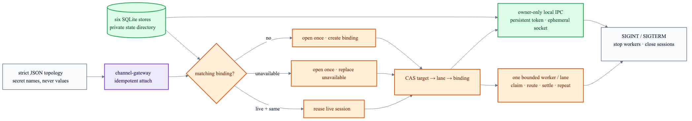

# Runtime startup

`crab-v2` turns the seven-box composition into one supervised process. `channel-gateway` is
stateless, so the state layout still contains six SQLite stores.



```text
runtime state/
├── agent-host.sqlite
├── bridge-credentials/
├── bridge-host.sqlite
├── channel-ipc.sock       owner-only, ephemeral
├── channel-ipc.token      owner-only, persistent
├── native-channel.sqlite
├── sub-agent-host.sqlite
├── trigger-inbox.sqlite
└── turn-router.sqlite
```

## Configuration

Schema `1` is strict JSON. It declares ACP commands, native channels and trigger lanes. Relative
paths resolve beside the config file. Secrets are referenced only by environment-variable name;
unknown fields, missing variables, broken references and zero-valued worker bounds fail startup.

Start from [`runtime.example.json`](../runtime/runtime.example.json):

Replace the example executable paths and agent-specific authority flags; they are placeholders,
not a portable ACP command line.

```sh
cargo run -p crab-v2-runtime --bin crab-v2 -- \
  --config runtime/runtime.json \
  --state-dir /private/path/to/crab-v2-state
```

## Restart contract

| Persisted state | Startup action |
|---|---|
| Matching live binding | Reuse its session; never start a duplicate process |
| Matching unavailable binding | Open one ACP session and atomically replace session + adapter metadata |
| Binding created before route CAS | Find it by channel/adapter identity, recover it, then register the route |
| No binding | Open one ACP session, bind it, then register the route |
| Changed intent with a live session | Fail with an attachment conflict; never replace live work implicitly |

Agent-owned compaction is not resumed or reconstructed. Durable trigger IDs still deduplicate
retries, and each configured lane is drained serially until SIGINT/SIGTERM stops workers and closes
the local endpoint, then the live ACP sessions. UI process disconnects never close a Crab-owned
session. See the [local transport contract](channel-ipc.md).
