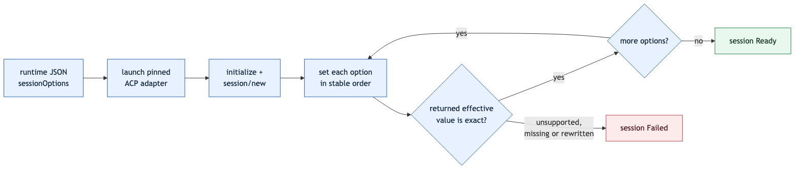
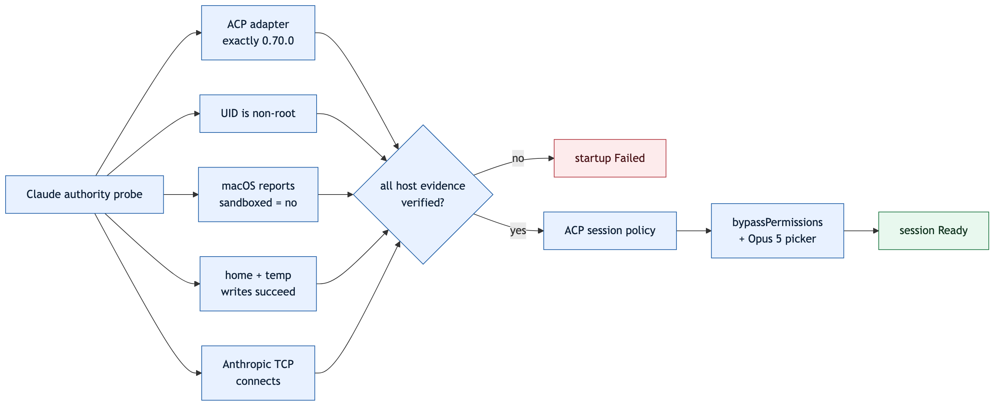
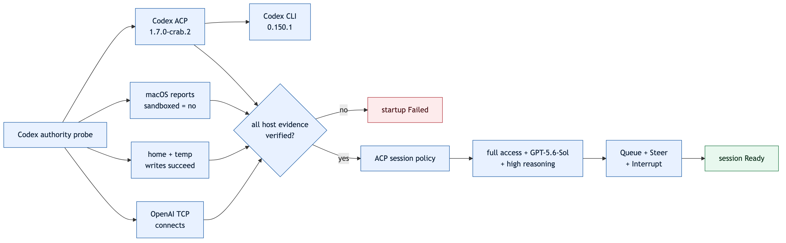

# Runtime startup

`crab-v2` turns the seven-box composition into one supervised process. `channel-gateway` is
stateless, so the state layout still contains six SQLite stores.


```text
runtime state/
├── agent-host.sqlite
├── bridge-credentials/
├── bridge-host.sqlite
├── channel-ipc.sock       owner-only, ephemeral
├── channel-ipc.token      owner-only, persistent
├── native-channel.sqlite
├── sub-agent-host.sqlite
├── trigger-inbox.sqlite
└── turn-router.sqlite
```

## Configuration

Schema `1` is strict JSON. It declares ACP commands, native channels and trigger lanes. Relative
paths resolve beside the config file. Secrets are referenced only by environment-variable name;
unknown fields, missing variables, broken references and zero-valued worker bounds fail startup.

Configured bridges may set `alertTarget: {channelId, lane}` to an existing route. Actionable
supervisor/auth failures and their recovery then wake that agent through durable queue-mode
triggers; the package cannot choose or forge this target.

Each agent may declare `sessionMcpServers`. Their commands resolve like other runtime commands and
are attached to every ACP session. The shipped presets register Crab's
[`crab-v2-sub-agent-mcp`](native-sub-agent-tools.md) and
[`crab-v2-bridge-mcp`](native-bridge-tools.md), so orchestration and harness extension work without
agent-specific plugins.

Start from [`runtime.example.json`](../runtime/runtime.example.json):

Replace the example executable paths and agent-specific authority flags; they are placeholders,
not a portable ACP command line.

Each `sessionOptions` entry is a required ACP policy, not a UI default. After `session/new`, Crab
sets every value through `session/set_config_option` and checks the returned effective state before
marking the session ready. An unsupported option, a rewritten value or an omitted result fails the
session closed.



### Claude Opus preset

[`runtime.claude-opus.example.json`](../runtime/runtime.claude-opus.example.json) is the first real
agent preset. It pins the official Claude ACP adapter to `0.70.0`, selects
`mode=bypassPermissions`, and selects the exact service-token picker ID `model=opus`, whose ACP
descriptor identifies Opus 5. The exact effective value makes a future rewrite fail closed. The
package pin and resolved model are separate things. `steeringExtension=sessionSteeringV1` also
requires the adapter's advertised `_session/steering` support. Active follow-ups are injected; an
idle race returns control to Crab and continues through a lifecycle-owned `session/prompt`.

The preset uses Crab's shell-free `crab-v2-claude-authority-probe`. On macOS it actively checks the
exact adapter version, non-root bypass eligibility, `launchctl`'s `sandboxed = no` result, writes in
both the user home and temporary directory, and a TCP connection to Anthropic. The host separately
checks the configured working directory and `sudo -n id -u`; ACP then confirms the session mode and
model. Any failed layer stops startup.



Build the release probe before starting the preset, then replace only the working directory. Keep
the configuration beside the committed example or replace the probe path with its deployed
location. The first-party probe currently requires macOS; other platforms must supply an equally
strict agent-specific probe. Claude authentication remains owned by Claude; no token is stored in
JSON. The production presets require `CLAUDE_CODE_OAUTH_TOKEN` by name so a long-running launchd
session does not depend on an interactive OAuth refresh. Its value exists only in the owner-private
process environment.

```sh
cargo build --release -p agent-host-implementation \
  --bin crab-v2-claude-authority-probe
cp runtime/runtime.claude-opus.example.json runtime/runtime.json
```

```sh
cargo run -p crab-v2-runtime --bin crab-v2 -- \
  --config runtime/runtime.json \
  --state-dir /private/path/to/crab-v2-state
```

### Codex preset

[`runtime.codex.example.json`](../runtime/runtime.codex.example.json) pins the official Codex ACP
adapter to `1.6.2` and verifies `mode=agent-full-access`, `model=gpt-5.6-sol`, and
`reasoning_effort=high` before readiness. It attaches the same bridge and sub-agent tools as the
Claude preset.

The shell-free `crab-v2-codex-authority-probe` verifies the exact adapter, macOS sandbox state,
home and temporary-directory writes, and OpenAI network reachability. The host still verifies the
workspace and passwordless root independently. Codex owns authentication: the adapter can reuse
its existing ChatGPT login; API-key deployments add `CODEX_API_KEY` or `OPENAI_API_KEY` to
`environmentFrom` and the owner-private environment file.

Codex `1.6.2` advertises `_session/steering`, but an idle race starts a new turn outside the
request lifecycle. Crab therefore leaves that extension disabled for this preset: Queue remains
portable and active Steer fails truthfully instead of creating unowned work.



```sh
cargo build --release -p agent-host-implementation \
  --bin crab-v2-codex-authority-probe
cp runtime/runtime.codex.example.json runtime/runtime.json
```

### Clean-machine bundle

For deployment, use the [verified runtime bundle](runtime-bundle.md) instead of rebuilding and
installing packages on the target. Its bundle-relative presets keep the same exact Claude and Codex
policies, verify either vendored adapter without `npx`, and register the bundled WhatsApp bridge:

```sh
make v2-bundle
python3 v2/dist/crab-v2-*/libexec/v2_bundle.py verify v2/dist/crab-v2-*
```

The target needs macOS, Node 22+, authentication for the selected agent, and the documented
unrestricted-host authority. First deployment defaults to Claude; pass `--agent codex` to select
the vendored Codex adapter. It does not need Rust, npm, network package access, or a runtime
installation step.

`crab-v2-health` reconciles the durable config with live bindings, ACP sessions and configured
bridges over owner-authenticated IPC. Deployment requires its `ready` signal; service status
requires `healthy` and preserves explicit bridge authentication/degradation actions. See the
[runtime health contract](runtime-health.md).

## Trigger ingress

`crab-v2-trigger` is the single supported recipe for cron, self-work and operator ingress. It reads
the owner-only token from the state directory and calls generated `trigger-inbox.enqueue`; it never
opens SQLite directly. Retries must reuse the same source ID and deduplication key.

```sh
crab-v2-trigger \
  --state-dir /private/path/to/crab-v2-state \
  --channel primary --lane primary \
  --source self-work --source-id jim --dedupe-key follow-up-42 \
  --mode queue --message "Continue the accepted follow-up"
```

Use `--message-json` for a native payload and `--not-before-ms` for delayed delivery. Modes are
`queue`, `steer` and `interrupt-and-steer`; queue is the default. Interrupt-and-steer atomically
accepts the trigger before requesting cooperative cancellation of active work.

## Bridge operations

`crab-v2-bridge` is the single supported operator path for bridge discovery, health, reconciliation,
authentication, credential lifecycle and shutdown. It uses the same owner-only local endpoint and
never opens runtime state directly. See the [operator flow](bridge-operations.md).

The bundled WhatsApp configuration is intentionally default-deny. Before relying on inbound
messages, set exact `inboundPolicy.directChatIds` or group `chatId` plus `senderIds` in the durable
runtime configuration. Missing and empty policies accept no inbound traffic; outbound delivery and
authentication remain available.

## Restart contract

| Persisted state | Startup action |
|---|---|
| Matching live binding | Reuse its session; never start a duplicate process |
| Matching unavailable binding | Resume the exact ACP session and recover the binding without changing IDs or delivery cursors |
| Resume explicitly unsupported / native session missing | Open one ACP session and atomically replace session + adapter metadata |
| Resume authority, storage or transport failure | Fail closed; never hide the fault behind replacement |
| Binding created before route CAS | Find it by channel/adapter identity, recover it, then register the route |
| No binding | Open one ACP session, bind it, then register the route |
| Changed intent with a live session | Fail with an attachment conflict; never replace live work implicitly |
| Changed intent with an unavailable session | Open one ACP session and atomically replace session + adapter metadata |

After configured parents are ready, `sub-agent-host.recover` reconciles durable children in stable
creation order. An eligible child resumes only its exact native ACP session, preserves both message
journals and event cursors, increments its durable restart count, and restarts its cursor pump.
Every non-resumable outcome is recorded as `Failed`; runtime startup continues without inventing a
replacement child. A failure of the recovery capability itself still aborts startup and cleans up
sessions already owned by the runtime.

Agent-owned compaction is not resumed or reconstructed. Durable trigger IDs still deduplicate
retries, and each configured lane is drained serially until SIGINT/SIGTERM stops ingress, workers
and bridges, then asks `agent-host` to detach its complete live set. Active work is cancelled and
acknowledged; native sessions are not closed. On restart, parents resume before durable children.
UI process disconnects never close a Crab-owned session. See the
[graceful detach contract](runtime-detach.md) and [local transport contract](channel-ipc.md).
