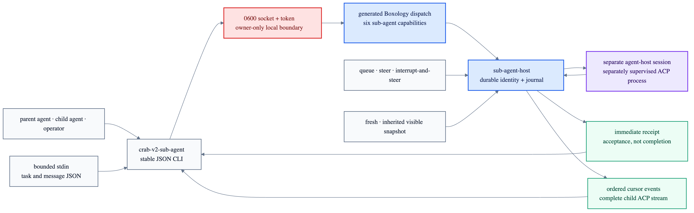

# Realtime sub-agent control

`crab-v2-sub-agent` exposes the complete generated `sub-agent-host` contract through Crab's
owner-only local IPC. Parent agents, child agents and operators use the same non-blocking boundary;
each child remains a separately supervised ACP subprocess.



```text
crab-v2-sub-agent
├── spawn          fresh or inherited visible context
├── send-child     queue, steer or interrupt-and-steer
├── send-parent    queue, steer or interrupt-and-steer
├── events         ordered cursor page with complete ACP JSON
├── status         durable identity, realization and lifecycle
└── stop           idempotent child shutdown
```

## Payload boundary

Large task and message payloads never appear in process arguments. `spawn`, `send-child` and
`send-parent` read exactly one strict JSON value from bounded stdin (2 MiB maximum). Responses are
compact JSON on stdout; errors use stable transport or Boxology domain codes on stderr.

```sh
printf '%s' '{"nativeTaskPrompt":[{"type":"text","text":"Research X"}],"metadata":{"role":"research"}}' \
  | crab-v2-sub-agent --state-dir /path/to/state \
      spawn child-1 parent-session claude /path/to/workspace inherit 42 true stdin
```

Receipts acknowledge durable acceptance, not model completion. Poll `events` with the returned
cursor to receive lifecycle, interaction and full native ACP events in order without blocking the
parent. Spawn and message IDs make retries idempotent; `stop` is idempotent too.

This CLI is the stable control-plane and future tool seam. A later slice will expose these same
capabilities as native tools inside the parent ACP session; this release does not claim automatic
tool injection.
