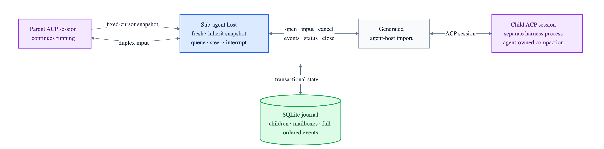

# Sub-agent host state and process contract

`sub-agent-host` gives Crab one portable sub-agent model across ACP harnesses. Each child is a new
`agent-host` session, which owns a separate ACP process; parent and child continue independently.



## Context modes

| Requested mode | Current realization | Guarantee |
|---|---|---|
| Fresh | `FreshSession` | Only explicit child bootstrap metadata and task are sent. |
| Inherit parent | `PortableSnapshot` | Message events through an immutable parent cursor are injected, capped at 4 MiB. |
| Native fork | Reserved | The contract can report `NativeAcpFork`, but this release does not claim it. |

Portable inheritance preserves the visible conversation, including exact native message JSON and
direction. It does not claim hidden model/provider state. If the caller forbids the portable
snapshot, spawn fails closed.

## Durable layout

```text
runtime-state/
└── sub-agent-host.sqlite
    ├── sub_agents       identity, context realization, lifecycle and child cursor
    ├── interactions     bidirectional idempotent delivery state
    ├── events           ordered local lifecycle, interaction and ACP journal
    └── native_events    exact child-sequence deduplication
```

- SQLite schema v1 uses WAL, foreign keys, full synchronous writes and fail-closed version checks.
- Spawn and message retries use caller IDs plus canonical request fingerprints; changed retries are
  rejected instead of silently reusing prior work.
- Parent-to-child and child-to-parent sends support queue, steer and cancel-then-queue. Delivery is
  accepted without waiting for model completion.
- A background cursor pump copies every child ACP event, including tool calls and agent-owned
  compaction events, into the sub-agent journal without narrowing the native JSON.
- This release cannot restore a child ACP process after Crab restarts. Active records and pending
  deliveries become failed on reopen, and nonzero crash-restart budgets are rejected. Native
  session resume/fork can later make bounded restart truthful without changing this schema's
  semantics.
