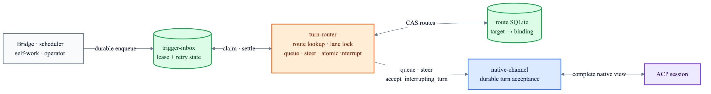

# Turn router state and settlement contract

`turn-router` is the explicit boundary between external triggers and native ACP sessions. A bridge
does not become a channel: it targets a route, while `native-channel` remains the complete session
view.



## Durable layout

```text
runtime-state/
├── trigger-inbox.sqlite    payload, lease, retry and terminal outcome
└── turn-router.sqlite      target channel → lane + native binding generation
```

- Route creation is idempotent. Replacement uses compare-and-swap generation control so stale
  configuration cannot redirect a trigger silently.
- One in-process lock serializes each lane. Different lanes may drain concurrently.
- The trigger ID becomes the native channel turn ID. If ACP accepted a turn but settlement was
  interrupted, the retry resolves through downstream deduplication instead of running twice.
- Queue and steer map directly to native channel input. Interrupting ingress maps to one
  `accept_interrupting_turn` call: a busy agent records the input and cancellation receipt as one
  actor-serialized operation, while an idle agent starts it normally.
- Text payloads become ACP text blocks. Callers may supply an exact `nativePrompt` array; trigger
  attachments become baseline ACP `resource_link` blocks.
- A successful drain settles every claimed lease. Unknown routes and invalid payloads dead-letter;
  transient channel failures retry with a bounded attempt budget; exhausted or definitively
  incompatible inputs dead-letter with stable diagnostic tags.
- SQLite schema v1 uses WAL, full synchronous writes and fail-closed version checks. This is a new
  state file, so no prior-schema migration is required.
