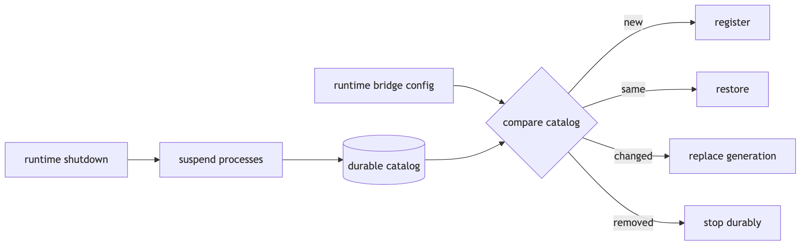

# Configured bridge reconciliation



Runtime configuration owns the desired bridge set. Startup compares it with bridge-host's durable
catalog, then registers new packages, restores identical registrations, replaces changed policy by
generation, and stops registrations removed from configuration.

The Boxology runtime composition selects `whatsapp-bridge-provider` as topology metadata. That
selection does not create, configure, or bind an instance; this runtime configuration and
bridge-host reconciliation remain the instance-policy and lifecycle boundary.

Graceful runtime shutdown suspends live bridge processes. It does not change `desiredRunning` or
the generation, so the next start restores the same registration without churn.

Launch configuration stores environment variable names only. Bridge-host clears the package
environment, copies exactly those names, and fails launch if one is absent. The WhatsApp example
explicitly forwards `PATH` because its executable uses `#!/usr/bin/env node`.

Before using the example WhatsApp registration, install its pinned dependencies once:

```bash
npm ci --prefix ../bridges/whatsapp
```

The path above is relative to the `v2/runtime` directory containing `runtime.example.json`.
